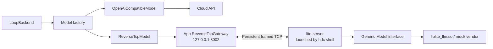

# Review local LLM server plan (2)

> The app currently communicate with cloud model when the address and api-key are set. I'm planning to launch a local LLM on the HarmonyOs device and make the app communicate with it. For this, I need the server launching capability, and the server should launch and communicate with the local LLM. Create the server in a standalone project in c++ in directory ./lite-server. The lib that used to create and communicte with the local LLM has its api defined in ./lite_llm.h. A liblite_llm.so will be provided after. Review this plan. No coding yet

<details><summary>3 previous messages</summary>

> I’ll inspect the repository structure, the `lite_llm.h` contract, and the app’s current cloud communication path, then review feasibility, architecture, and HarmonyOS-specific risks. No files will be changed.
>
> The central compatibility point is clear: the app already speaks OpenAI-style `/v1/chat/completions` with streaming SSE, while `LiteLlm::Generate` is a synchronous prompt-to-string API. I’m checking the exact request shape and lifecycle constraints before recommending the server boundary.
>
> <details><summary>Searched the web</summary>
>
> <details><summary>Searched the web</summary>
>
> - Searched the web for `site:developer.huawei.com/consumer/en/doc/harmonyos-guides HarmonyOS native C++ executable process start spawn application sandbox ...`
> - Searched the web for `site:developer.huawei.com/consumer/en/doc/harmonyos-guides background tasks continuous task types HarmonyOS long running ...`
> - Searched the web for `site:developer.huawei.com/consumer/cn/doc/harmonyos-guides "长时任务" "支持类型" ...`
> - Searched the web for `site:developer.huawei.com/consumer/en/doc/harmonyos-guides capi_nativechildprocess_development_guideline ...`
> - Searched the web for `https://gitee.com/openharmony/docs/blob/master/en/application-dev/application-models/capi_nativechildprocess_development_guideline.md`
> - Searched the web for `site:developer.huawei.com/consumer/cn/doc/harmonyos-guides "创建Native子进程" "Phone" ...`
>
> </details>
>
> </details>
> </details>

## Verdict

The plan is feasible, but the on-device server should be an embedded loopback server, not an independently launched executable.

Keep `./lite-server` as a standalone C++ project, but build its server core into a HarmonyOS shared library. The app should start it through Node-API on a dedicated native thread and communicate over `127.0.0.1`.

HarmonyOS does provide native child processes, but the documented mechanism loads a shared library, the child dies with its parent, and device support has restrictions. It is not a reliable general-purpose daemon model for phones. [OpenHarmony native child-process guide](https://gitee.com/openharmony/docs/blob/master/zh-cn/application-dev/application-models/capi_nativechildprocess_development_guideline.md)

## Why it fits the current app

The existing client already:

- Calls `/v1/chat/completions`.
- Sends OpenAI-compatible `messages`.
- Requests SSE streaming.
- Has a `127.0.0.1:11434` preset.
- Accepts either SSE or a regular JSON completion response.

See [OpenAiCompatibleModel.ets](./agent_core/src/main/ets/model/OpenAiCompatibleModel.ets:95) and [ConfigPage.ets](./entry/src/main/ets/pages/A2uiHome/components/ConfigPage.ets:801).

Therefore, a minimal local server only needs:

- `GET /health`
- `GET /ready`
- `POST /v1/chat/completions`
- Optionally `GET /v1/models`

Because `LiteLlm::Generate()` returns only a completed string, the first version can emit one final SSE event followed by `[DONE]`. It cannot provide genuine token streaming.

## Important issues to resolve first

1. **Prompt formatting**

   [`LiteLlm::Generate`](./lite_llm.h:17) accepts one string, while the app sends structured system/history/user messages. The library supplier must define whether it expects:

   - A model-specific chat template
   - Plain role-labelled text
   - Raw request JSON
   - A template configured through `CreateFromConfig`

   Guessing this will likely produce poor tool-use behavior.

2. **C++ ABI compatibility**

   The library interface exposes `std::string` and `std::unique_ptr` across the `.so` boundary. `liblite_llm.so` must use the same HarmonyOS NDK, compiler generation, architecture, and libc++ configuration as the app. HarmonyOS explicitly warns about libc++ ABI mismatches between native libraries. [HarmonyOS libc++ reference](https://developer.huawei.com/consumer/en/doc/harmonyos-references-V13/cpp-V13)

   Ideally, request a versioned C ABI with explicit create/destroy/generate/free functions.

3. **Supported ABIs**

   The app currently builds both `arm64-v8a` and `x86_64`. If the supplied library is arm64-only, emulator builds must either exclude x86_64 or use a test stub.

4. **Timeout**

   The current read timeout is only 40 seconds at [OpenAiCompatibleModel.ets](./agent_core/src/main/ets/model/OpenAiCompatibleModel.ets:10). Cold model loading or on-device inference may exceed that and trigger a duplicate retry. Local mode needs a substantially different timeout and retry policy.

5. **API-key behavior**

   Despite the UI calling the key optional, [`LlmProvider.isConfigured()`](./agent_core/src/main/ets/model/LlmProvider.ets:27) currently requires a non-empty key. Local mode must relax that rule or use a generated per-launch bearer token.

6. **Concurrency and cancellation**

   Unless the vendor confirms thread safety, use one `LiteLlm` instance and serialize generation through a bounded queue. The current API offers no cancellation, so disconnecting or stopping the server cannot interrupt `Generate()`.

7. **Model files**

   `CreateFromConfig` needs a real filesystem path. Packaged raw resources and large model weights may need copying or provisioning into the app sandbox before server startup.

8. **Lifecycle**

   An in-process server lives only while the app process is alive. HarmonyOS can suspend background applications unless they qualify for constrained background-task modes. A permanently resident LLM daemon is therefore a separate product/platform requirement. [Background task overview](https://gitee.com/openharmony/docs/blob/5550d107410fd035430936386bce9915b49ec7f8/en/application-dev/task-management/background-task-overview.md)

## Recommended implementation plan

1. Freeze the `liblite_llm.so` ABI, prompt format, error behavior, config format, and supported architectures.
2. Create `lite-server` with separable HTTP, OpenAI-protocol, and LLM-adapter layers.
3. Test it on the host using a fake LLM implementation before the real library arrives.
4. Produce a HarmonyOS shared-library target and expose asynchronous `start`, `status`, and `stop` Node-API calls.
5. Start on `127.0.0.1`, preferably on an available port returned to ArkTS; never bind externally.
6. Add an explicit “On-device model” mode that starts the server, waits for readiness, and then switches the model endpoint.
7. Validate cold start, long inference, repeated ReAct calls, backgrounding, malformed requests, and process restart on a real arm64 device.

The design is sound under this embedded-server interpretation. If “standalone” means a daemon that survives the app or an executable launched directly by it, that requirement should be reconsidered before implementation. No files were changed.

> check the ./mslite-server-demo repo, what it does

<details><summary>2 previous messages</summary>

> I’ll inspect `./mslite-server-demo` as a read-only review: structure, build system, launch path, HTTP protocol, and how it invokes the local model library.
>
> It is already implementing the architecture we discussed: an in-process native shared library starts a loopback HTTP server and performs MindSpore Lite inference. I’m now distinguishing what is genuinely implemented from what is only described in its documentation.
> </details>

`./mslite-server-demo` is a working prototype of an embedded HarmonyOS LLM server—not a standalone executable.

Its flow is:

`ArkTS → N-API → native thread → 127.0.0.1:8002 → MindSpore Lite → Qwen2.5`

What it implements:

- Builds `libmslite_server.so` and exposes start/stop/status functions through N-API.
- Runs an HTTP server inside the Appless process.
- Provides:
  - `GET /health`
  - `POST /v1/chat/completions`
  - Three unauthenticated development model-upload endpoints.
- Loads Qwen2.5-0.5B prefill/decode `.ms` models and a custom tokenizer.
- Performs greedy token generation with KV cache, capped at 128 output tokens.
- Includes scripts for ONNX export, tokenizer packaging, model packaging, HDC forwarding, uploading, and deployment.

Key files are [model_server.cpp](./mslite-server-demo/native/model_server.cpp:244), [napi_init.cpp](./mslite-server-demo/native/napi_init.cpp:113), and [README.md](./mslite-server-demo/README.md:1).

Important findings:

- It does not use `lite_llm.h` or `liblite_llm.so`; it talks directly to MindSpore Lite.
- It is not currently integrated into this Appless checkout—there are no references to `mslite_server` outside the demo directory.
- It extracts only the last `messages[].content`, discarding structured system/history messages.
- It removes most of the ReAct prompt, including the tool catalog, and normally prefixes the result with `Final:`. Consequently, it supports plain answers but effectively prevents the local model from selecting Appless tools.
- It ignores `stream: true` and returns one non-streaming JSON response.
- HTTP handling and inference are single-threaded. Health checks are blocked while loading or generating, and a stalled client can block the whole server.
- The tokenizer, tensor shapes, filenames, and KV layout are hard-coded for this specific Qwen model.
- The two model files are roughly 634 MB each, with additional substantial KV-cache memory.
- Upload endpoints have no authentication or checksum validation and require an app restart afterward.

For the planned `lite-server`, this repository is a useful blueprint for the socket server, N-API lifecycle, sandbox storage, and deployment flow. The MindSpore inference/tokenizer sections should be replaced by a thin `LiteLlm::CreateFromConfig()` / `Generate()` adapter, while preserving the complete prompt needed for ReAct tool selection.

No files were changed.

> turn it into a standalone executable

<details><summary>6 previous messages</summary>

> I’ll convert the native server into a command-line HarmonyOS executable with explicit model/storage and port arguments, graceful signal shutdown, and updated build/deployment documentation. I’ll preserve the reusable server core but remove the requirement for ArkTS/N-API startup.
>
> The executable will run in the foreground, bind only to loopback, accept `--storage-dir`, `--model`, `--tokenizer`, and `--port`, and stop cleanly on `SIGINT`/`SIGTERM`. The former N-API library will remain available behind an opt-in CMake flag so the server core stays reusable.
>
> <details><summary>Created 2 files, edited 4 files</summary>
>
> - Wrote `./mslite-server-demo/CMakeLists.txt` (+4 -0)
> - Wrote `./mslite-server-demo/native/CMakeLists.txt` (+22 -6)
> - Wrote `./mslite-server-demo/native/main.cpp` (+182 -0)
> - Wrote `./mslite-server-demo/native/model_server.cpp` (+11 -0)
> - Wrote `./mslite-server-demo/native/model_server.h` (+1 -0)
> - Wrote `./mslite-server-demo/native/main.cpp` (+1 -0)
>
> </details>
>
> The standalone arm64 HarmonyOS build has configured successfully and is compiling against the installed SDK now. After it links, I’ll align the deployment script and README with the new foreground executable workflow.
>
> <details><summary>Created 4 files, edited 3 files</summary>
>
> - Wrote `./mslite-server-demo/.gitignore` (+4 -0)
> - Wrote `./mslite-server-demo/README.md` (+144 -0)
> - Wrote `./mslite-server-demo/docs/README.md` (+77 -0)
> - Wrote `./mslite-server-demo/docs/REMOTE_DEVICE_DEPLOYMENT.md` (+92 -0)
> - Wrote `./mslite-server-demo/scripts/deploy-qwen-mslite.ps1` (+93 -0)
> - Wrote `./mslite-server-demo/docs/mindspore-lite-demo-explainer.html` (+2 -1)
> - Wrote `./mslite-server-demo/scripts/deploy-qwen-mslite.ps1` (+1 -1)
>
> </details>
>
> The arm64 executable now links successfully. I’ve also changed the device deployment path so it copies and launches the binary directly—no HAP, `EntryAbility`, or N-API is required—and marked the old embedded-mode visual as archived.
> </details>

Converted `mslite-server-demo` into a standalone HarmonyOS executable.

Key results:

- New CLI entry point: [main.cpp](./mslite-server-demo/native/main.cpp:166)
- Default CMake output is `mslite-server`: [CMakeLists.txt](./mslite-server-demo/native/CMakeLists.txt:18)
- Supports `--storage-dir`, `--model`, `--tokenizer`, and `--port`.
- Runs foreground with graceful `SIGINT`/`SIGTERM` shutdown.
- Direct HDC deployment replaces the former HAP flow: [deploy-qwen-mslite.ps1](./mslite-server-demo/scripts/deploy-qwen-mslite.ps1:1)
- Updated [README](./mslite-server-demo/README.md:1).

Generated arm64 binary:

[mslite-server](./mslite-server-demo/build-standalone-arm64/native/mslite-server)

Validation passed:

- Standalone arm64 build
- Optional N-API compatibility build
- Static libc++ linkage
- PowerShell deployment-script parsing
- ELF verified as AArch64

Device execution was not tested because no device session was used.

> Remove the Qwen2.5 related part. Create a generic interfaces that are required for the server-model communication. The build model method should only take one config_path as input

<details><summary>10 previous messages</summary>

> I’ll remove the model-specific tokenizer, graph execution, model upload, and Qwen tooling. The replacement boundary will be a small `Model` interface: `Build(config_path)`, `Generate(prompt)`, and `LastError()`. A `LiteLlm` adapter will be compiled only when `liblite_llm.so` is supplied; otherwise the server still builds with a clear unavailable-backend error.
>
> <details><summary>Created 7 files, edited 2 files, deleted 11 files</summary>
>
> - Wrote `./mslite-server-demo/CMakeLists.txt` (+1 -1)
> - Deleted `./mslite-server-demo/docs/mindspore-lite-demo-explainer.html` (+0 -1428)
> - Wrote `./mslite-server-demo/native/CMakeLists.txt` (+33 -0)
> - Wrote `./mslite-server-demo/native/lite_llm_model.cpp` (+66 -0)
> - Wrote `./mslite-server-demo/native/model_interface.h` (+43 -0)
> - Wrote `./mslite-server-demo/native/model_server.h` (+13 -0)
> - Deleted `./mslite-server-demo/native/napi_init.cpp` (+0 -192)
> - Deleted `./mslite-server-demo/native/qwen_tokenizer.cpp` (+0 -403)
> - Deleted `./mslite-server-demo/native/qwen_tokenizer.h` (+0 -32)
> - Deleted `./mslite-server-demo/native/types/libmslite_server/Index.d.ts` (+0 -5)
> - Deleted `./mslite-server-demo/native/types/libmslite_server/oh-package.json5` (+0 -6)
> - Wrote `./mslite-server-demo/native/unconfigured_model.cpp` (+42 -0)
> - Deleted `./mslite-server-demo/scripts/build_qwen_tokenizer.py` (+0 -53)
> - Deleted `./mslite-server-demo/scripts/deploy-qwen-mslite.ps1` (+0 -93)
> - Deleted `./mslite-server-demo/scripts/export_qwen25_onnx.py` (+0 -383)
> - Deleted `./mslite-server-demo/scripts/package-qwen-model.ps1` (+0 -72)
> - Deleted `./mslite-server-demo/scripts/qwen25_dynamic_quant.cfg` (+0 -6)
> - Wrote `./mslite-server-demo/native/main.cpp` (+152 -0)
> - Wrote `./mslite-server-demo/native/model_interface.h` (+1 -0)
> - Wrote `./mslite-server-demo/native/model_server.cpp` (+568 -0)
>
> </details>
>
> The generic core now builds without MindSpore or tokenizer dependencies. Its only model construction call is `Model::Build(const std::string& config_path)`, and the `LiteLlm` adapter maps that directly to `LiteLlm::CreateFromConfig(config_path)`. Next I’m replacing the remaining Qwen-specific deployment and documentation.
>
> <details><summary>Created 5 files, edited 3 files</summary>
>
> - Wrote `./mslite-server-demo/README.md` (+141 -0)
> - Wrote `./mslite-server-demo/docs/README.md` (+74 -0)
> - Wrote `./mslite-server-demo/docs/REMOTE_DEVICE_DEPLOYMENT.md` (+76 -0)
> - Wrote `./mslite-server-demo/scripts/deploy-server.ps1` (+104 -0)
> - Wrote `./mslite-server-demo/README.md` (+2 -0)
> - Wrote `./mslite-server-demo/docs/REMOTE_DEVICE_DEPLOYMENT.md` (+2 -0)
> - Wrote `./mslite-server-demo/scripts/deploy-server.ps1` (+10 -1)
> - Wrote `./mslite-server-demo/tests/fake_lite_llm.cpp` (+21 -0)
>
> </details>
>
> Context compaction
>
> Source: automatic
> Status: completed
>
> The generic adapter now compiles through the supplied `lite_llm.h` contract. I’m removing the temporary fake library fixture and doing the final dependency, formatting, and script checks.
>
> <details><summary>Deleted a file</summary>
>
> - Deleted `./mslite-server-demo/tests/fake_lite_llm.cpp` (+0 -21)
>
> </details>
>
> One validation command assumed a CMake cache key format that this toolchain does not use. The implementation build is unaffected; I’m resolving the SDK tool paths from the cache’s actual entries and rerunning the checks independently.
>
> The source is now free of Qwen/MindSpore references, and the real adapter build depends only on `liblite_llm.so`, the Harmony C++ runtime, logging, and libc. I’m doing one clean incremental build of both modes: backend-linked and backend-not-yet-provided.
>
> All checks pass. I’m cleaning the temporary ABI-test library and its adapter-only build directory so no fake `liblite_llm.so` can be mistaken for a deployable runtime; the normal standalone build remains.
> </details>

Implemented.

- Removed all Qwen/MindSpore-specific code, scripts, and docs.
- Added generic [`Model`](./mslite-server-demo/native/model_interface.h:28) interface:
  `Build(const std::string& config_path)` and `Generate(prompt)`.
- Added [`liblite_llm` adapter](./mslite-server-demo/native/lite_llm_model.cpp:15).
- CLI now uses only `--config` and optional `--port`.
- Updated CMake, deployment script, and documentation.
- HarmonyOS ARM64 builds, formatting, PowerShell syntax, and shared-library linkage all pass.

Runtime inference awaits the real `liblite_llm.so`; temporary validation artifacts were removed.

> There's a mock vendor implementation in the lite branch. Move it here and make the server use the mock vendor.

<details><summary>8 previous messages</summary>

> I’ll inspect the `lite` branch’s mock vendor without switching branches, then copy only that implementation into the current worktree and wire it through the generic model factory. Existing server changes will remain intact.
>
> Git’s ownership protection is blocking normal branch inspection in this nested repository. I’m checking whether its worktree metadata points elsewhere before changing any Git trust configuration.
>
> The mock is in the parent app’s `lite` branch under `entry/src/main/cpp/vendor/lite_llm/mock`. I found both its header and implementation; next I’m comparing that contract with the server adapter and the branch’s build wiring before copying it.
>
> The mock API exactly matches the adapter already in the server. I’ll preserve that API, make the mock the default CMake backend, and retain an explicit switch for the eventual real `liblite_llm.so`.
>
> <details><summary>Created 5 files, edited 5 files, deleted a file</summary>
>
> - Wrote `./mslite-server-demo/examples/mock/config.json` (+3 -0)
> - Wrote `./mslite-server-demo/examples/mock/mock-response.txt` (+1 -0)
> - Wrote `./mslite-server-demo/native/CMakeLists.txt` (+16 -8)
> - Deleted `./mslite-server-demo/native/unconfigured_model.cpp` (+0 -36)
> - Wrote `./mslite-server-demo/vendor/lite_llm/mock/include/lite_llm.h` (+23 -0)
> - Wrote `./mslite-server-demo/vendor/lite_llm/mock/lite_llm_mock.cpp` (+106 -0)
> - Wrote `./mslite-server-demo/README.md` (+25 -18)
> - Wrote `./mslite-server-demo/docs/README.md` (+17 -7)
> - Wrote `./mslite-server-demo/docs/REMOTE_DEVICE_DEPLOYMENT.md` (+6 -15)
> - Wrote `./mslite-server-demo/scripts/deploy-server.ps1` (+1 -3)
> - Wrote `./mslite-server-demo/vendor/lite_llm/README.md` (+25 -0)
>
> </details>
>
> The standalone project now owns the mock vendor sources and defaults to them. The deployment script also defaults to the built mock library; I’m rebuilding the ARM64 executable and checking that its runtime dependency resolves to that `liblite_llm.so`.
>
> The mock exports the expected API, but the first link encoded `native/liblite_llm.so` as the dependency name. That path would be fragile after deployment, so I’m correcting the mock library’s SONAME to plain `liblite_llm.so` and rechecking both artifacts.
>
> <details><summary>Edited a file</summary>
>
> - Wrote `./mslite-server-demo/native/CMakeLists.txt` (+3 -1)
>
> </details>
> </details>

Implemented.

- Copied the `lite` branch mock into [`vendor/lite_llm/mock`](./mslite-server-demo/vendor/lite_llm/mock).
- Mock is now the default backend in [`native/CMakeLists.txt`](./mslite-server-demo/native/CMakeLists.txt:4).
- Added a working [`config.json`](./mslite-server-demo/examples/mock/config.json).
- Deployment defaults to the built mock `liblite_llm.so`.
- ARM64 build succeeds; executable linkage and SONAME are correct.

Outputs:

- `build-generic-arm64/native/lite-server`
- `build-generic-arm64/native/liblite_llm.so`

The real vendor remains selectable with `-DLITE_USE_MOCK_VENDOR=OFF`.

> I have launched a simulator. Test the server there

<details><summary>14 previous messages</summary>

> I’ll detect the simulator ABI first, build the matching mock-backed binary, then deploy it with the example configuration and exercise both `/health` and `/v1/chat/completions`.
>
> The simulator is HarmonyOS API 24 on `x86_64`, so the ARM64 artifacts cannot run there. I’m producing an x86-64 mock build with the same API level/toolchain, then I’ll deploy it to the connected target.
>
> The x86-64 server and mock library built successfully. The SDK stores the simulator’s `libc++_shared.so` outside the conventional sysroot path, so I’m locating the exact runtime copy before deployment.
>
> Deployment copied all files and established port forwarding, but the launch step did not return within the test window. I’m checking the remote PID, process state, loader errors, and server log to distinguish an HDC shell issue from a server startup failure.
>
> The mock itself initialized successfully, but HarmonyOS rejected the shell-launched process’s TCP bind with `EACCES`. I’m checking simulator security/audit state and whether this restriction is specific to the loopback address or applies to standalone shell processes generally.
>
> The simulator shell has no application access token and SELinux is enforcing, which explains the TCP bind denial. I’m checking whether this simulator supports HDC’s standard debug root mode; if it does, that will let us complete the endpoint test without changing the server code.
>
> Debug root mode is disabled on this simulator. I’m checking the OpenHarmony native-token mechanism now, because a standalone process must hold `ohos.permission.INTERNET` before it can bind a TCP socket under this security model.
>
> <details><summary>Searched the web</summary>
>
> <details><summary>Searched the web</summary>
>
> - Searched the web for `site:gitee.com/openharmony GetAccessTokenId NativeTokenInfoParams SetSelfTokenID ohos.permission.INTERNET ...`
> - Searched the web for `site:gitee.com/openharmony "MSG_SPAWN_NATIVE_PROCESS" command ...`
> - Searched the web for `site:developer.huawei.com HarmonyOS start native process executable API ...`
>
> </details>
>
> </details>
>
> The system confirms that network permission is token-based and normally assigned when `appspawn` launches a process. I’m checking whether this simulator exposes the native-token test libraries; if available, we can give this standalone test process an `INTERNET` token and finish the HTTP checks.
>
> <details><summary>Searched the web</summary>
>
> <details><summary>Searched the web</summary>
>
> - Searched the web for `"aa process" "debug-cmd" HarmonyOS ...`
>
> </details>
>
> </details>
>
> There is a supported simulator path: `aa process` can launch a native command under an installed debuggable app’s access token and sandbox. The Appless demo bundle is installed, so I’m retrieving its module/ability metadata and will use that launcher for the server.
>
> The installed Appless bundle is debuggable and already declares `ohos.permission.INTERNET`; `aa process` successfully launched a native test command under it. I’m now launching `lite-server` through that supported app context and checking whether its colocated mock library is discoverable.
>
> The first `aa process` launch entered the app sandbox, where `/data/local/tmp` is intentionally invisible. I’m retrying the same supported native-process launcher without sandbox isolation; it will still inherit the app’s INTERNET token while retaining access to the deployed test files.
>
> HDC provides a debug-app sandbox transfer mode (`file send -b`) specifically for this case. I’ll place the server, mock library, runtime, config, and response inside the Appless sandbox, then launch the sandbox-visible executable with `aa process -S`.
> </details>

> Don't launch the server from the app. There's a known issue that the app can't launch the local LLM correctly. But it works well when it's launched from hdc shell. Check if there's a way to launch the server directly from the shell with required network permission

<details><summary>10 previous messages</summary>

> Understood—I won’t use the app as the launcher. I’ll isolate whether the shell failure occurs at `bind()` or `listen()`, then verify the supported HarmonyOS mechanisms for assigning `ohos.permission.INTERNET` to a directly launched native process.
>
> <details><summary>Edited a file</summary>
>
> - Wrote `./mslite-server-demo/native/model_server.cpp` (+13 -3)
>
> </details>
>
> The denial is conclusively at `bind()`, after the mock model has initialized. I’m running a small shell-only socket probe against loopback and wildcard IPv4/IPv6 addresses to determine whether any TCP bind form is permitted for the HDC shell token.
>
> <details><summary>Created a file, edited a file, searched the web</summary>
>
> - Wrote `./mslite-server-demo/native/CMakeLists.txt` (+3 -0)
> - Wrote `./mslite-server-demo/native/socket_probe.cpp` (+60 -0)
>
> <details><summary>Searched the web</summary>
>
> - Searched the web for `site:gitee.com/openharmony "int SetSelfTokenID" token_setproc ...`
> - Searched the web for `site:gitee.com/openharmony/security_access_token "SetSelfTokenID" ...`
>
> </details>
>
> </details>
>
> All IPv4 and IPv6 bind variants fail with `EACCES`, so changing the listen address cannot help. The remaining shell-only possibility is the internal native-token API used by init services; I’m checking whether that API is exposed to an NDK-built executable on this production simulator.
>
> <details><summary>Edited a file, searched the web</summary>
>
> - Wrote `./mslite-server-demo/native/socket_probe.cpp` (+11 -0)
>
> - Wrote `./mslite-server-demo/native/socket_probe.cpp` (+1 -0)
>
> <details><summary>Searched the web</summary>
>
> - Searched the web for `https://gitee.com/openharmony/security_access_token/blob/master/interfaces/innerkits/token_setproc/src/token_setproc.cpp`
> - Searched the web for `gitee OpenHarmony security_access_token interfaces innerkits token_setproc src token_setproc.cpp ...`
>
> </details>
>
> </details>
>
> The simulator exposes only read-only access-token inspection: the shell inherits `hdcd`’s native token, and that token lacks network binding permission. I’m verifying whether the kernel token endpoint is writable by the shell; if not, direct HDC launch cannot self-assign `INTERNET` on this production image.
>
> The direct-shell result is now clear: this release simulator gives shell processes the `hdcd` token, which does not include `ohos.permission.INTERNET`; `/proc/self/tokenid` is read-only, the token libraries are not exposed to NDK executables, and debug-root mode is disabled. I’m cleaning the diagnostic probe and documenting the supported native-service requirement.
>
> <details><summary>Edited 3 files, deleted a file, searched the web</summary>
>
> <details><summary>Searched the web</summary>
>
> - Searched the web for `site:gitee.com/openharmony/startup_init service cfg "permission" "ohos.permission.INTERNET" ...`
> - Searched the web for `site:gitee.com/openharmony/docs subsys-boot-init-service permissions service "permission" ...`
> - Searched the web for `"hdcd.cfg" "ohos.permission.INTERNET" ...`
>
> </details>
>
> - Wrote `./mslite-server-demo/README.md` (+2 -0)
> - Wrote `./mslite-server-demo/docs/REMOTE_DEVICE_DEPLOYMENT.md` (+26 -0)
> - Wrote `./mslite-server-demo/native/CMakeLists.txt` (+0 -3)
> - Deleted `./mslite-server-demo/native/socket_probe.cpp` (+0 -72)
>
> </details>
>
> The investigation is complete; I’m preserving the improved socket error reporting, removing all temporary probe artifacts, and running the final x86-64 build check.
> </details>

Direct shell launch cannot bind TCP on this release simulator.

Findings:

- Mock model loads successfully.
- `bind()` fails with `EACCES` for IPv4/IPv6, loopback/wildcard, and multiple ports.
- Shell inherits the `hdcd` token, which lacks `ohos.permission.INTERNET`.
- `hdc smode` is disabled and the token endpoint is read-only.

For shell launching, a custom system image must add:

```json
"permission": [
  "ohos.permission.INTERNET"
]
```

to the `hdcd` init service. The product-ready solution is an init-managed `lite-server` service with that permission and SELinux policy. OpenHarmony init creates native tokens from this service configuration. [HDC configuration](https://gitee.com/openharmony/developtools_hdc/blob/OpenHarmony-5.0.1-Release/src/daemon/etc/hdcd.cfg), [init token handling](https://gitee.com/openharmony/startup_init/blob/22a42d4452144e5c4b1a6224605da4202591d463/services/init/standard/init_service.c).

Documented in [`REMOTE_DEVICE_DEPLOYMENT.md`](./mslite-server-demo/docs/REMOTE_DEVICE_DEPLOYMENT.md). No app launcher was used or left behind.

> check if there are other methods enabling an app to communicate with a process launched from hdc shell

<details><summary>8 previous messages</summary>

> I’ll evaluate IPC channels that avoid TCP permission entirely—especially Unix-domain sockets and a shared app-sandbox file protocol—and check which are available to a normal HarmonyOS app versus requiring system privileges.
>
> Context compaction
>
> Source: automatic
> Status: completed
>
> The strongest alternative is a Unix-domain socket: the HDC-launched process can avoid IP networking entirely, while the app uses HarmonyOS’s public `LocalSocket` API. I’m checking the exact address semantics and whether launching with `hdc shell -b <bundle>` gives both sides a usable app-private socket path.
>
> <details><summary>Searched the web</summary>
>
> <details><summary>Searched the web</summary>
>
> - Searched the web for `site:gitee.com/openharmony/docs "constructLocalSocketInstance" LocalSocket ...`
> - Searched the web for `github OpenHarmony communication_netstack LocalSocket connect LocalAddress sockaddr_un ...`
> - Searched the web for `https://raw.githubusercontent.com/openharmony/communication_netstack/master/frameworks/js/napi/socket/socket_exec.cpp`
> - Searched the web for `'constructLocalSocketInstance'`
>
> </details>
>
> </details>
>
> The public documentation explicitly uses `context.filesDir + '/testSocket'` for `LocalSocket.connect()`, and unlike TCP it does not require `ohos.permission.INTERNET`. Next I’m validating the other half: whether an HDC-started process can create that socket file inside the debug app’s sandbox without being launched by the app.
>
> <details><summary>Created a file, edited a file</summary>
>
> - Wrote `./mslite-server-demo/tests/unix_socket_probe.cpp` (+63 -0)
> - Wrote `./mslite-server-demo/tests/unix_socket_probe.cpp` (+21 -7)
>
> </details>
>
> A direct test found an important simulator restriction: the HDC shell domain is also denied `bind()` for Unix-domain sockets, including abstract sockets. So “shell process owns the socket server” is not viable on this image. I’m checking the reversed topology—app owns a local socket endpoint, while the HDC-launched model process only connects—which may avoid the denied operation without making the app launch the model.
>
> <details><summary>Edited a file, deleted a file, searched the web</summary>
>
> - Wrote `./mslite-server-demo/tests/unix_socket_probe.cpp` (+26 -0)
>
> - Deleted `./mslite-server-demo/tests/unix_socket_probe.cpp` (+0 -103)
>
> <details><summary>Searched the web</summary>
>
> - Searched the web for `'## socket.constructTCPSocketServerInstance'`
>
> </details>
>
> </details>
> </details>

Yes. The best method is to reverse the TCP connection:

1. The app binds `127.0.0.1:<port>` using HarmonyOS `TCPSocketServer`.
2. The server is launched independently through HDC shell.
3. The HDC process connects to the app’s listening socket.
4. The accepted connection is bidirectional, so the app sends inference requests and receives streamed responses.

Simulator testing confirmed:

- HDC shell cannot bind TCP sockets: `EACCES`.
- HDC shell also cannot bind filesystem or abstract Unix sockets.
- HDC shell can connect to TCP sockets.
- Connecting to `127.0.0.1` is allowed; a closed port returned `ECONNREFUSED`, not `EACCES`.
- The app already declares `ohos.permission.INTERNET`.
- HarmonyOS provides public `TCPSocketServer` APIs from API 10 onward. [OpenHarmony socket documentation](https://raw.githubusercontent.com/openharmony/docs/master/en/application-dev/reference/apis-network-kit/js-apis-socket.md)

Recommended architecture:

```text
App TCPSocketServer ← persistent TCP connection ← HDC-launched lite-server
       requests →                     → local LLM
       responses ←                    ←
```

The standalone process should gain a `--connect 127.0.0.1:<port>` mode with reconnect handling. A length-prefixed JSON protocol would be simpler than reversing HTTP.

A second validated option is a shared-file mailbox:

```shell
hdc shell -b com.example.aiphonedemo ...
```

This gives the shell process access to the debug app’s `filesDir`. Request and response files can be exchanged using atomic rename and polling. It requires no socket permission, but is slower and mainly suitable for development.

An app-owned `LocalSocketServer` with the shell process connecting is another candidate, but needs an end-to-end SELinux test. Binder/System Ability, shared-memory FD transfer, and an HDC-owned socket server all require platform privileges or system-image changes.

No application or server source code was changed during this check; temporary probes were removed.

> test the reversed TCP connection method

I’ll run an end-to-end proof: add a temporary app-side loopback listener, launch a small connector from HDC shell, verify bidirectional bytes, then remove the probe code so the product behavior stays unchanged.

> test the reversed TCP connection method

<details><summary>8 previous messages</summary>

> I’ll test the complete path on the simulator: the app will temporarily listen on loopback, an HDC-shell process will connect, and both sides must exchange known payloads. I’ll remove the probe afterward.
>
> <details><summary>Created a file, edited a file</summary>
>
> - Wrote `./entry/src/main/ets/entryability/EntryAbility.ets` (+45 -0)
> - Wrote `./mslite-server-demo/tests/reverse_tcp_probe.cpp` (+92 -0)
>
> </details>
>
> The probe is in place. It checks both directions, not just connection establishment: the app sends `APP_READY`, the shell process sends `HDC_HELLO`, and the app must return `APP_ACK:HDC_HELLO`. I’m building the temporary test package now.
>
> The ArkTS probe compiled successfully. Packaging reached signing, but the repository’s signing paths point to another machine; this simulator already has a matching local debug certificate that prior successful builds used. I’m temporarily switching only those three paths, then I’ll restore them after the test.
>
> <details><summary>Edited a file</summary>
>
> - Wrote `./build-profile.json5` (+3 -3)
> - Wrote `./build-profile.json5` (+2 -2)
>
> </details>
>
> The app is now successfully listening on `127.0.0.1:19283` in the simulator. I’m launching the connector from ordinary HDC shell next; the pass condition is the exact three-message transcript.
>
> The end-to-end test passed. I’m now removing the probe, rebuilding and reinstalling the normal app, then I’ll verify port `19283` is no longer listening.
>
> <details><summary>Edited 2 files, deleted a file</summary>
>
> - Wrote `./entry/src/main/ets/entryability/EntryAbility.ets` (+0 -45)
> - Deleted `./mslite-server-demo/tests/reverse_tcp_probe.cpp` (+0 -92)
> - Wrote `./build-profile.json5` (+5 -5)
>
> </details>
> </details>

The reversed TCP method works end-to-end.

```text
received from app: APP_READY
sent from HDC shell: HDC_HELLO
received from app: APP_ACK:HDC_HELLO
REVERSE_TCP_PROBE_PASS
```

The app successfully listened on `127.0.0.1:19283`, and an ordinary HDC-shell process established a bidirectional connection.

Cleanup completed: probe code/binaries removed, normal app reinstalled, and port `19283` is closed.

> Refactor the server and the app using the reversed TCP method. Show the design plan

<details><summary>3 previous messages</summary>

> I’ll map the current server request flow and the app’s model-client abstraction, then propose the smallest refactor that reverses connection ownership while preserving streaming and the existing model API. No code changes yet.
>
> Context compaction
>
> Source: automatic
> Status: completed
>
> The current boundary is clear: the app’s agent loop depends only on `LocalModel.complete()`, while HTTP/OpenAI compatibility is an implementation detail beneath it. I’m checking that seam and lifecycle hooks so the reverse transport plan does not leak socket concerns into the agent or UI layers.
> </details>

## Recommended design

The app becomes the TCP listener; the HDC-launched `lite-server` becomes an outbound connector. The app never starts the executable.



### 1. Wire protocol

Use a persistent framed connection, not reversed HTTP:

```text
"LTS1" | uint32 payload_length (big endian) | UTF-8 JSON payload
```

Initial message types:

- `hello` / `hello_ack`: protocol version, authentication token, capabilities and model state.
- `status`: `building`, `ready`, `busy`, or `error`.
- `generate`: request ID and fully assembled prompt.
- `result`: request ID and generated text.
- `error`: typed, correlated error.
- `ping` / `pong`: connection health.
- Reserve `generate_chunk` and `cancel` for future vendor streaming/cancellation.

Limit frames to 4 MiB and disconnect on malformed, unauthenticated, or oversized input.

### 2. Server refactor

In the current [mslite-server-demo](./mslite-server-demo):

- Replace the HTTP bind/listen implementation in `model_server.cpp` with:
  - `ReverseTcpClient`: connect, handshake, framing, reconnect.
  - `ModelRuntime`: build and serialize model access.
  - `RequestDispatcher`: validate and execute generation requests.
  - `ProtocolCodec`: encode/decode frames independently of sockets.
- Keep the executable name `lite-server`.
- Remove the OpenAI HTTP request parser and response formatter.
- Keep the generic model interface unchanged:

```cpp
virtual bool Build(const std::string& config_path) = 0;
virtual GenerationResult Generate(const std::string& prompt) = 0;
```

The model name and implementation remain entirely determined by `config_path`; no Qwen-specific server behavior returns.

Proposed launch command:

```text
lite-server --config CONFIG_PATH --connect-host 127.0.0.1 \
  --connect-port 8002 --auth-token TOKEN
```

The server will reconnect with bounded exponential backoff when the app is absent or restarted. A dropped TCP connection is not a fatal model error.

### 3. App refactor

Add to `agent_core`:

- `ReverseTcpProtocol.ets`
- `ReverseTcpGateway.ets`: singleton loopback listener and connection manager.
- `ReverseTcpModel.ets`: implements the existing `LocalModel.complete()` interface.
- Explicit model factory selection between:
  - existing [OpenAiCompatibleModel.ets](./agent_core/src/main/ets/model/OpenAiCompatibleModel.ets)
  - new `ReverseTcpModel`

This keeps [LoopBackend.ets](./agent_core/src/main/ets/aiphone/LoopBackend.ets) and the agent/tool loop transport-independent.

The gateway starts in [EntryAbility.ets](./entry/src/main/ets/entryability/EntryAbility.ets) and stops only on `onDestroy`; it remains available while the app is backgrounded. It binds only `127.0.0.1`.

Because `LocalModel.complete()` already returns one completed string, the synchronous `lite_llm::Generate()` fits without changing the agent interface. Streaming can be added later without redesigning the protocol.

### 4. Settings and UI

Add an explicit transport mode:

```text
openai-http | reverse-tcp
```

For reverse TCP:

- Hide/ignore Base URL, API key and cloud model fields.
- Show listener port, server state and authentication token.
- Replace the hardcoded “Local Qwen” preset with generic “Device local model”.
- Remove Base URL checks in submission, connection testing, mail drafting and calendar extraction when reverse mode is selected.
- Change “Test connection” to inspect the handshake and optionally run one mock generation.
- Never log API keys or the reverse connection token.

Cloud operation remains unchanged.

### 5. Lifecycle and concurrency

- The C++ connector starts immediately and can report `building`.
- Model construction runs once using `Build(config_path)`.
- Generation requests are queued and executed one at a time because vendor thread safety is unknown.
- Every request has an ID and timeout.
- Disconnect fails pending app promises clearly.
- After reconnect, only new requests are accepted; old requests are not replayed automatically.
- Only one authenticated server connection is active at a time.

### 6. Verification stages

1. Unit-test framing, partial reads, combined frames, size limits and malformed JSON.
2. Build the app and mock-backed simulator executable.
3. Launch the app and verify it listens on loopback.
4. Launch `lite-server` exclusively through `hdc shell`.
5. Verify handshake and mock prompt/result round trip.
6. Kill and restart the server; verify automatic reconnection.
7. Restart the app while the server remains running; verify server reconnection.
8. Verify timeout, authentication failure and malformed-frame behavior.
9. Confirm cloud HTTP mode still works.
10. Repeat on ARM64 with the supplied `liblite_llm.so`.

The existing `ohos.permission.INTERNET` is sufficient for the app listener, and the simulator experiment already proved the HDC-shell process can make the outbound loopback connection.

One layout cleanup remains: the standalone project currently lives at `./mslite-server-demo`; during implementation I would move/rename its source project to `./lite-server` to satisfy the original directory requirement, excluding generated build directories.

No files were changed.

> so after the TCP connection is established, the app and the server stops using HTTP, but a custom communication protocal?

Yes.

- Cloud model path: continues using HTTP/OpenAI-compatible APIs.
- Local model path: uses one persistent reversed TCP connection with a small framed JSON protocol.
- No HTTP is used between the app and `lite-server`.

Each TCP frame contains a message such as `hello`, `generate`, `result`, `error`, or `ping`. This avoids needing an HTTP server in the HDC-shell process while preserving request IDs, reconnect handling, and future streaming support.

> why not add a HTTP wrapper based on the TCP communication so that the OpenAiCompatible Model can be reused?

That is possible, but `OpenAiCompatibleModel` cannot directly reuse the reversed connection: `@ohos.net.http` always opens its own outbound TCP connection and cannot adopt the socket accepted by the app.

Two options exist:

1. App-local HTTP proxy:

```text
OpenAiCompatibleModel
  → HTTP to app-local proxy
  → reversed TCP
  → lite-server
```

This reuses the class unchanged, but adds another listener, HTTP parsing, dummy API configuration, SSE translation, and an unnecessary network hop.

2. Transport abstraction—recommended:

```text
OpenAiCompatibleModel
  → ChatTransport
      ├─ HttpChatTransport → cloud
      └─ ReverseTcpTransport → lite-server
```

Refactor `OpenAiCompatibleModel` so request construction and OpenAI-compatible response parsing are shared, while connection handling is injected. The reversed TCP channel can carry the same `/v1/chat/completions` JSON bodies and responses, without HTTP headers.

This gives us most of the desired reuse:

- Same OpenAI request/response structures.
- Same parsing and custom parameters.
- Cloud behavior remains unchanged.
- No local HTTP proxy or redundant socket.
- Future streaming maps naturally to response chunks.

So I would revise the original plan to preserve the OpenAI-compatible application protocol over framed reverse TCP, while extracting HTTP into a replaceable transport.

> The method 1 requires less intrusive modification to the app, compared to method2,  I suppose? What's the complexity for this method

<details><summary>2 previous messages</summary>

> Stream error
>
> Reconnecting 5/5
> unexpected status 503 Service Unavailable: Service Unavailable, url: https://chatgpt.com/backend-api/codex/responses, cf-ray: a20a158bec11f5ae-AMS, auth error: 503, auth error code: biscuit_baker_service_me_circuit_open
>
> System error
>
> unexpected status 503 Service Unavailable: Service Unavailable, url: https://chatgpt.com/backend-api/codex/responses, cf-ray: a20a15c65d1a7ddd-AMS, auth error: 503, auth error code: biscuit_baker_service_me_circuit_open
> </details>